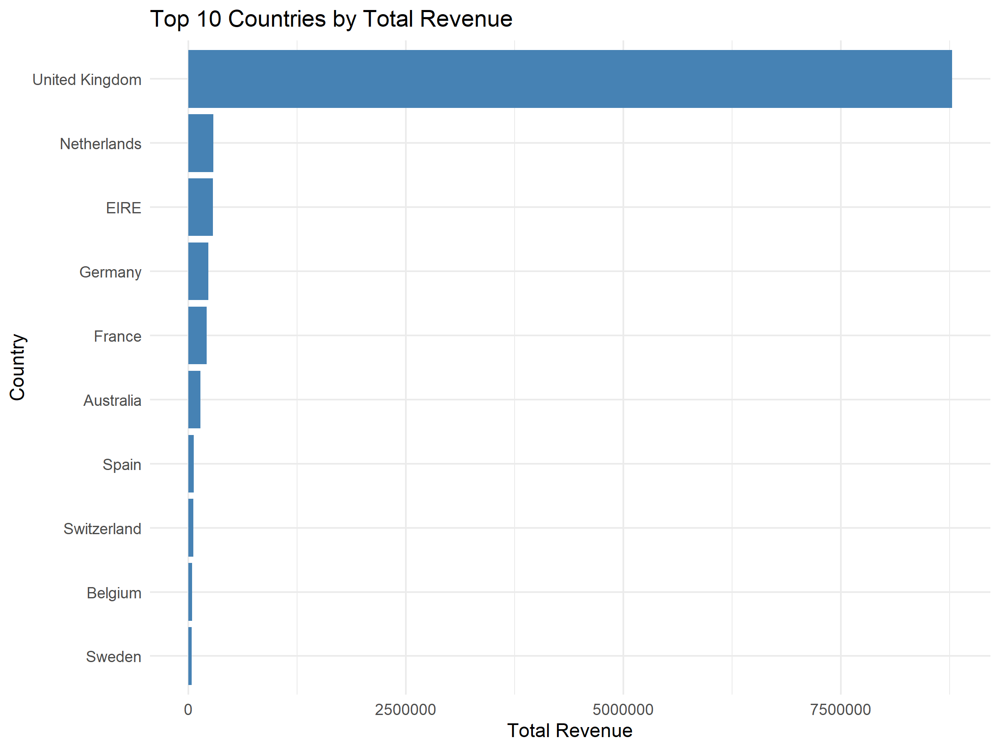
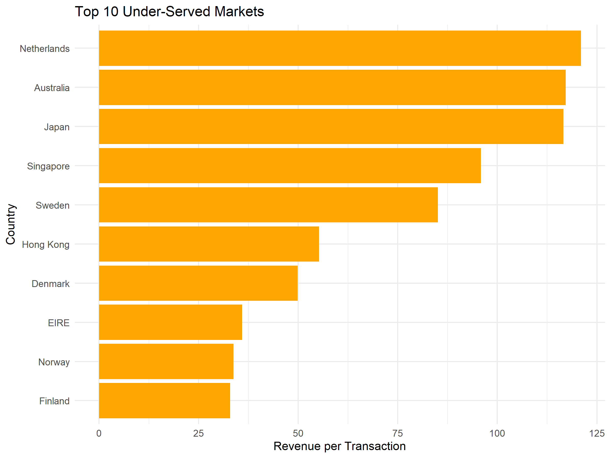
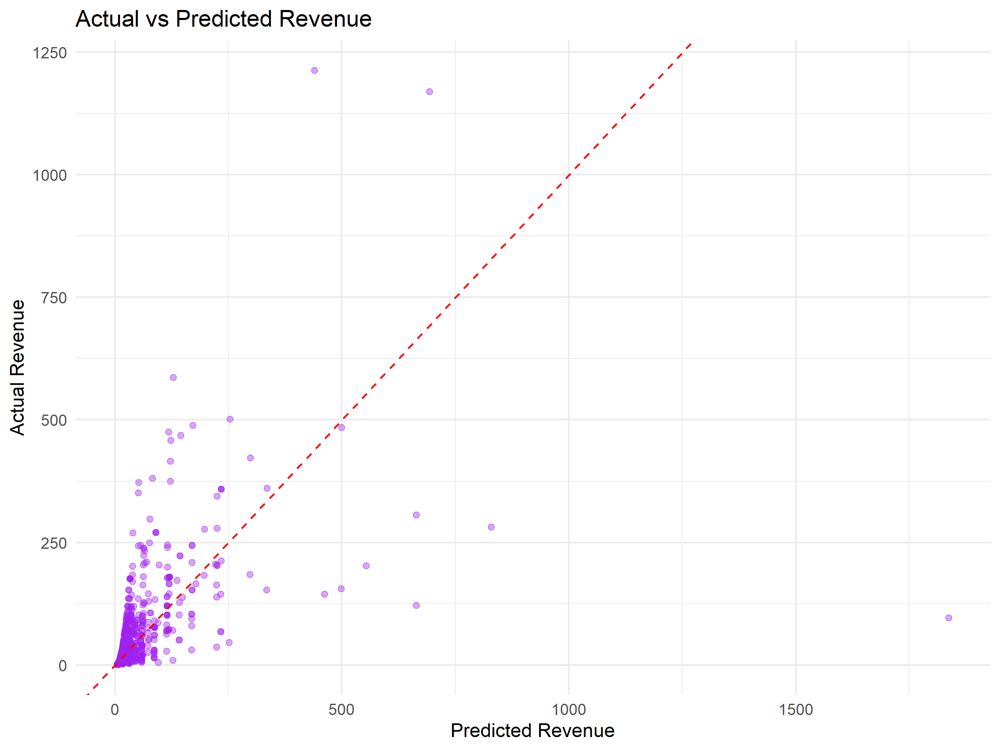

# Retail Market & Location-Based Business Analysis

## Overview
This project analyzes a global retail dataset (500k+ transactions) to understand the factors affecting revenue across countries, identify under-served markets, and explore seasonality and pricing effects. The analysis provides actionable insights for business expansion and market strategy.

## Dataset
- **Dataset:** Online Retail (UCI)  
- **Source:** [Online Retail Dataset](https://archive.ics.uci.edu/ml/datasets/Online+Retail)  
- **Description:** Contains transactions from a UK-based online retailer between 2010–2011, including InvoiceNo, StockCode, Description, Quantity, InvoiceDate, UnitPrice, CustomerID, and Country.

## Tools & Packages
- R programming language  
- Libraries: `tidyverse`, `dplyr`, `ggplot2`, `readxl`  

## Project Steps
1. **Load and inspect data**: Check data structure, dimensions, and summary statistics.  
2. **Clean data**: Remove negative quantities, prices, and missing country values; create a `Revenue` column.  
3. **Handle skewness and outliers**: Identify and remove extreme revenue values above 50,000 to improve interpretability.  
4. **Aggregate revenue per country**: Calculate total revenue, average revenue, and transaction count by country.  
5. **Identify top and under-served countries**: Compute revenue per transaction and identify countries with high potential but low transaction volume.  
6. **Time-based analysis**: Explore monthly revenue trends to capture seasonality effects.  
7. **Pricing analysis**: Summarize unit price distribution to understand typical transaction values.  
8. **Market concentration analysis**: Calculate revenue share of top countries to assess market concentration risk.  
9. **Predictive analysis**: Build a simple linear regression model to predict revenue based on quantity and unit price.

## Key Insights
- Retail revenue is highly right-skewed; median transaction values better represent typical customer behavior than the mean.  
- A small number of countries dominate total revenue, indicating significant market concentration risk.  
- Several countries show high revenue per transaction but lower transaction volume, suggesting under-served markets with high growth potential.  
- Revenue exhibits seasonal patterns, making timing a critical factor in retail business strategy.  
- Pricing analysis shows most transactions occur in low-to-mid price ranges, emphasizing volume-driven business models.  
- Predictive modeling shows how quantity and unit price drive revenue, providing actionable insights for pricing and inventory strategy.

 ## Visualizations

### Top 10 Countries by Revenue

### Top 10 Under-Served Markets

### Monthly Revenue Trend

### Actual vs Predicted Revenue

## How to Run
1. Clone or download the repository.  
2. Ensure R and the required libraries (`tidyverse`, `ggplot2`, `readxl`) are installed.  
3. Set the correct file path to the dataset in the R script (`retail_analysis.R`).  
4. Run the script to reproduce the analysis and visualizations.

## Next Steps / Extensions
- Extend the analysis to include predictive modeling (e.g., linear regression to predict revenue).  
- Apply insights to local emerging markets like Kenya to identify SME opportunities.  
- Explore additional features such as product categories, customer segmentation, or promotions.

## Author
Michael Ngugi  
Data Science Student | Aspiring Data Analyst  
LinkedIn: www.linkedin.com/in/michael-ngugi-447b33343 

GitHub: https://github.com/michaelngugi210/Retail-Market---Location-Based-Business-Analysis.git
